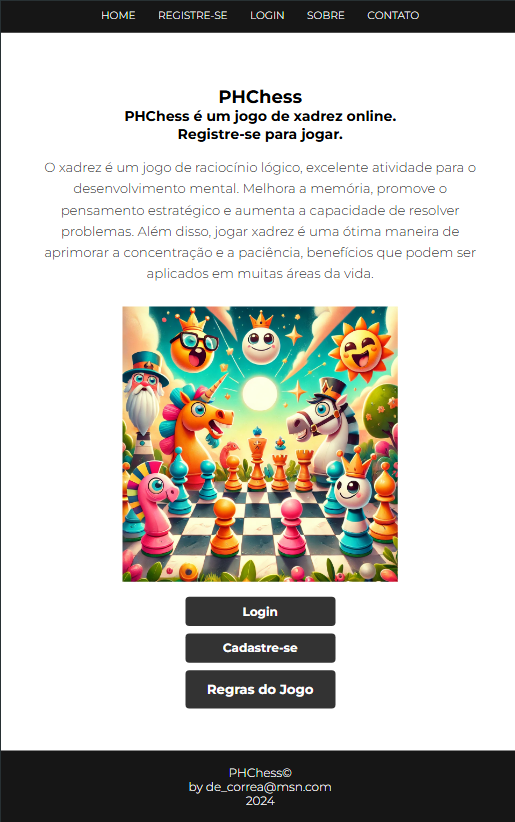

# PHChess

## 📌 Sobre o projeto

Este é um projeto de um jogo de xadrez desenvolvido em PHP. O jogo esta sendo desenvolvido com o objetivo de aprender e praticar a linguagem PHP.

## ♟️ Sobre o Jogo de Xadrez

O xadrez é um jogo de tabuleiro de natureza recreativa e competitiva para dois jogadores. Embora tenha por base um tabuleiro, o xadrez é considerado um jogo de mesa, não um jogo de tabuleiro. O xadrez é praticado por milhões de pessoas em todo o mundo, sendo também uma modalidade de competição, com torneios nacionais e internacionais organizados pela FIDE (Federação Internacional de Xadrez).

Os xadristas dispõem de 16 peças cada um, sendo elas: 1 rei, 1 dama, 2 torres, 2 cavalos, 2 bispos e 8 peões. O objetivo do jogo é dar xeque-mate no rei adversário. Isso ocorre quando o rei está em uma posição tal que não pode se mover para nenhuma casa sem ser capturado por uma peça adversária. O xeque-mate é a jogada que encerra a partida, sendo a vitória do jogador que o aplicou. O xadrez é um jogo de estratégia, onde a habilidade e a experiência do jogador são fundamentais para a vitória. 

## 🎮 Screenshots

em desenvolvimento...

## 🎬 Demonstração do Projeto

em desenvolvimento...

## 🛠️ Conceitos de Programação Utilizados

em desenvolvimento...

## 📚 Referências

- [PHP](https://www.php.net/)
- [HTML](https://developer.mozilla.org/pt-BR/docs/Web/HTML)
- [CSS](https://developer.mozilla.org/pt-BR/docs/Web/CSS)
- [JavaScript](https://developer.mozilla.org/pt-BR/docs/Web/JavaScript)

## 👩‍💻 Autor

- *Andre Guilherme Correa* | [correandre8@gmail.com](mailto:correandre8@gmail.com)
